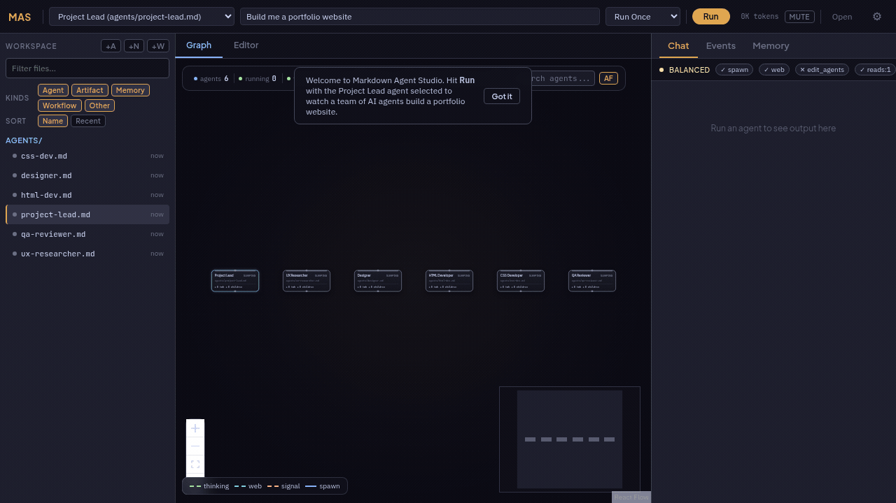

# Markdown Agent Studio

[](https://www.npmjs.com/package/markdown-agent-studio)
[](https://github.com/RobThePCGuy/markdown-agent-studio/actions/workflows/ci.yml)
[](https://opensource.org/licenses/MIT)
[](https://nodejs.org/)

A visual IDE for building AI agents that learn from experience — not from training data or prompt engineering, but from doing the work.



## The Problem with AI Agents Today

Every AI agent created under the same model starts with the same intelligence. We've tried to differentiate them through prompt engineering (telling them what to be) and fine-tuning (showing them what others have done). But neither of these is actual learning. A prompted agent doesn't get better at writing stories by writing stories. It gets the same result every time, from the same static starting point.

Humans don't work this way. We learn by doing, failing, reflecting, and carrying that experience forward. Our entire lives are spent on this loop. AI agents have no equivalent — until now.

## What This Project Does

Markdown Agent Studio is a workspace where agents develop specialization through their own experience.

Here is how it works: you give an agent a task — say, "learn to write better short stories." The agent runs, produces output, and reflects on what it did. On the next run, its memory from the previous session feeds back in. It sees what it tried, what fell flat, what worked. It spawns sub-agents to research narrative structure or study dialogue patterns. When context fills up, a summarizer compresses working memory into long-term knowledge — deduplicating what it already knows, preserving what's new. Run after run, the agent's accumulated knowledge grows deeper and more refined.

The result is an agent that has genuinely specialized — not because a human engineered the right prompt, but because the agent earned its expertise through iterative practice.

---

## Table of Contents

- [Why Markdown](#why-markdown)
- [How the Learning Loop Works](#how-the-learning-loop-works)
- [Getting Started](#getting-started)
- [The Sample Project](#the-sample-project)
- [Agent File Reference](#agent-file-reference)
  - [Frontmatter Schema](#frontmatter-schema)
  - [Safety Modes](#safety-modes)
  - [Built-in Tools](#built-in-tools)
  - [Custom Tools](#custom-tools)
- [Workflow Files](#workflow-files)
- [Autonomous Mode](#autonomous-mode)
- [Memory System](#memory-system)
- [Inter-Agent Communication](#inter-agent-communication)
- [Observability](#observability)
- [Agent Templates](#agent-templates)
- [Configuration](#configuration)
- [Keyboard Shortcuts](#keyboard-shortcuts)
- [MCP Server Integration](#mcp-server-integration)
- [Running as an npm Package](#running-as-an-npm-package)
- [Architecture](#architecture)
- [Development](#development)
- [Troubleshooting](#troubleshooting)
- [License](#license)

---

## Why Markdown

Most agent tooling forces a choice: write code (powerful but inaccessible) or use a visual builder (accessible but opaque). Agents defined in Markdown sit in the middle. They're plain text files you can read, edit, version-control, and share. The YAML frontmatter configures behavior; the body is the system prompt. No framework lock-in, no proprietary format.

```md
---
name: Story Writer
model: gemini-2.5-flash
safety_mode: balanced
reads: ["**"]
writes: [artifacts/**, memory/**]
permissions:
  spawn_agents: true
  web_access: true
autonomous:
  max_cycles: 20
  resume_mission: true
---

You are a story writer developing your craft through practice.
Read your memory for lessons from previous sessions before starting.
Write drafts to files. Reflect on what works and what doesn't.
Spawn a critic agent to review your output. Incorporate feedback.
Record what you learned to memory before finishing.
```

That file *is* the agent. No scaffolding code, no configuration UI, no deployment step.

## How the Learning Loop Works

1. **Run** — The agent executes its task, using tools to research, write, and collaborate with sub-agents.
2. **Reflect** — Before the session ends, the agent records what it accomplished, what failed, and what to try next.
3. **Compress** — When context fills up, a summarizer agent distills working memory into long-term knowledge. Duplicates are discarded; new insights are preserved.
4. **Resume** — On the next run, accumulated memory feeds back in. The agent picks up where it left off, building on everything it has learned.

Each cycle makes the agent more capable at its specific task. Not because the model changed, but because the agent's experiential knowledge grew.

---

## Getting Started

### Prerequisites

- **Git**: <https://git-scm.com/downloads>
- **Node.js 20.19+**: <https://nodejs.org/>

### Setup

```bash
git clone https://github.com/RobThePCGuy/markdown-agent-studio.git
cd markdown-agent-studio
npm install
npm run dev
```

Open `http://localhost:5173`. Pick an agent, enter a prompt, click **Run**.

No API key? That's fine — the app uses a scripted demo provider automatically so you can explore the full experience first.

### Provider Keys

```bash
cp .env.example .env.local
```

Add your provider keys (any or all):

```bash
VITE_GEMINI_API_KEY=your_key_here
VITE_OPENAI_API_KEY=your_key_here
VITE_ANTHROPIC_API_KEY=your_key_here
```

If no key is set, demo mode is used. Select your provider and model in Settings. State is persisted in browser storage.

---

## The Sample Project

On first launch, a six-agent team is loaded to demonstrate multi-agent orchestration. The task: build a portfolio website from scratch.

| Agent | Role | Safety Mode |
|-------|------|-------------|
| **Project Lead** | Plans the project, delegates to specialists, writes the final summary | balanced |
| **UX Researcher** | Searches the web for current design trends, writes research report | safe |
| **Designer** | Reads research findings, produces a design spec with tokens and layout | balanced |
| **HTML Developer** | Builds semantic HTML from the design spec | safe |
| **CSS Developer** | Creates responsive CSS with custom properties (works in parallel with HTML Dev) | safe |
| **QA Reviewer** | Audits HTML/CSS using a custom `design_review` tool, produces a scored report | gloves_off |

Hit **Run** with the Project Lead selected and watch the team coordinate: delegation, parallel execution, signaling, and consolidation — all visualized on the graph in real time.

The demo produces real output: `site/index.html`, `site/styles.css`, `artifacts/design-spec.md`, `artifacts/qa-report.md`, and `artifacts/summary.md`.

---

## Agent File Reference

Agent files live in `agents/*.md`. The YAML frontmatter configures behavior; everything below the closing `---` is the system prompt.

### Frontmatter Schema

| Field | Type | Default | Description |
|-------|------|---------|-------------|
| `name` | string | *required* | Display name for the agent |
| `model` | string | Settings default | LLM model override (e.g. `gemini-2.5-flash`, `gpt-4o`, `claude-sonnet-4-20250514`) |
| `safety_mode` | string | `gloves_off` | Permission tier: `safe`, `balanced`, or `gloves_off` |
| `reads` | string[] | mode default | Glob patterns the agent can read (e.g. `["agents/**", "memory/**"]`) |
| `writes` | string[] | mode default | Glob patterns the agent can write (e.g. `["artifacts/**"]`) |
| `permissions` | object or string[] | mode default | Fine-grained permission overrides (see [Safety Modes](#safety-modes)) |
| `allowed_tools` | string[] | all | Whitelist of built-in tools this agent can use |
| `blocked_tools` | string[] | none | Blacklist of built-in tools this agent cannot use |
| `gloves_off_triggers` | string[] | none | Keywords in the mission prompt that auto-escalate to `gloves_off` |
| `tools` | object[] | none | Custom tool definitions (see [Custom Tools](#custom-tools)) |
| `autonomous` | object | none | Autonomous cycle config (see [Autonomous Mode](#autonomous-mode)) |
| `mcp_servers` | object[] | none | MCP server connections (see [MCP Server Integration](#mcp-server-integration)) |

### Safety Modes

Every agent runs under one of three safety modes that control what it's allowed to do. Set `safety_mode` in the frontmatter, or let it default to `gloves_off`.

| Permission | `safe` | `balanced` | `gloves_off` |
|------------|--------|------------|--------------|
| Spawn agents | — | ✓ | ✓ |
| Edit agents | — | — | ✓ |
| Delete files | — | — | ✓ |
| Web access | — | ✓ | ✓ |
| Signal parent | ✓ | ✓ | ✓ |
| Custom tools | — | ✓ | ✓ |
| Default reads | `agents/**`, `memory/**`, `artifacts/**` | `**` | `**` |
| Default writes | `memory/**`, `artifacts/**` | `memory/**`, `artifacts/**` | `**` |

Aliases: `street` maps to `safe`; `autonomous` and `track` map to `gloves_off`.

You can override individual permissions regardless of mode:

```yaml
safety_mode: safe
permissions:
  web_access: true    # grant web access even in safe mode
```

**Trigger-based escalation:** If you set `gloves_off_triggers`, the agent automatically escalates to `gloves_off` when any trigger keyword appears in the mission prompt:

```yaml
safety_mode: safe
gloves_off_triggers:
  - "delete"
  - "modify agents"
  - "full access"
```

### Built-in Tools

Agents access tools based on their safety mode and permission settings. The full tool inventory:

**File System**

| Tool | Description |
|------|-------------|
| `vfs_read` | Read file contents from the virtual file system |
| `vfs_write` | Write or overwrite a file |
| `vfs_list` | List files by directory prefix |
| `vfs_delete` | Delete a file (requires delete permission) |

**Agent Orchestration**

| Tool | Description |
|------|-------------|
| `spawn_agent` | Create and run a new agent inline with a task |
| `delegate` | Hand off a task to an existing agent with context |
| `signal_parent` | Send a message back to the agent that spawned you |

**Web**

| Tool | Description |
|------|-------------|
| `web_search` | Search the web (uses provider's search API) |
| `web_fetch` | Fetch and parse a URL's content |

**Memory**

| Tool | Description |
|------|-------------|
| `memory_write` | Write an entry to working memory with tags |
| `memory_read` | Search working memory by query or tags |

**Knowledge Base**

| Tool | Description |
|------|-------------|
| `knowledge_query` | Semantic search across all agents' long-term memory (requires vector memory) |
| `knowledge_contribute` | Add typed knowledge to the shared graph (skill, fact, procedure, observation, mistake, preference) |

**Messaging**

| Tool | Description |
|------|-------------|
| `publish` | Broadcast a message to a named channel |
| `subscribe` | Listen to a channel and check for pending messages |

**Shared State**

| Tool | Description |
|------|-------------|
| `blackboard_write` | Write a key-value pair visible to all agents in the current run |
| `blackboard_read` | Read from the shared blackboard (omit key to list all) |

**Task Management**

| Tool | Description |
|------|-------------|
| `task_queue_write` | Add, update, or remove tasks (actions: `add`, `update`, `remove`) |
| `task_queue_read` | Query the task queue with filters (`pending`, `in_progress`, `done`, `blocked`, `all`) |

### Custom Tools

You can define custom tools in the agent's frontmatter. Each custom tool spawns a temporary sub-agent when invoked, with template variables substituted from the caller's arguments.

```yaml
tools:
  - name: design_review
    description: Evaluate HTML and CSS against a design specification
    parameters:
      html_path:
        type: string
        description: Path to the HTML file
      css_path:
        type: string
        description: Path to the CSS file
    prompt: |
      Review the HTML at {{html_path}} and CSS at {{css_path}}.
      Score accessibility, responsiveness, performance, and design fidelity.
      Return a structured report with scores out of 100.
    model: gemini-2.5-flash          # optional: override model for this tool
    result_schema:                    # optional: enforce output structure
      type: object
      properties:
        overall_score:
          type: number
        breakdown:
          type: object
```

When an agent calls `design_review`, a temporary agent is created at `agents/_custom_design_review_<timestamp>.md`, runs the prompt with parameters injected, and returns the result to the caller.

---

## Workflow Files

Workflow files live in `workflows/*.md` and define multi-step pipelines with dependency ordering.

```md
---
name: Research Pipeline
steps:
  - id: research
    agent: agents/researcher.md
    prompt: "Research {topic}"
    outputs: [findings, sources]
  - id: synthesis
    agent: agents/synthesizer.md
    depends_on: [research]
    prompt: "Synthesize {research.findings} with sources from {research.sources}"
    outputs: [synthesis]
  - id: review
    agent: agents/reviewer.md
    depends_on: [synthesis]
    prompt: "Review {synthesis.synthesis} for accuracy"
---
```

Steps execute in topological order. Steps with no unmet dependencies run in parallel (controlled by the `Workflow Parallel Steps` setting, default 1). Circular dependencies are detected and rejected. Variables use `{step_id.output_name}` syntax for upstream data access.

---

## Autonomous Mode

Autonomous mode runs an agent through multiple cycles, with memory carrying forward between each one.

```yaml
autonomous:
  max_cycles: 20              # 1–1000, default: 10
  stop_when_complete: true    # stop early if agent assesses task is done
  resume_mission: true        # load previous mission state and continue
  seed_task_when_idle: true   # auto-generate follow-up tasks when queue empties
```

| Option | What it does |
|--------|-------------|
| `max_cycles` | Hard limit on iteration count. Each cycle is a full run → reflect → compress loop. |
| `stop_when_complete` | The agent self-assesses completion after each cycle. If satisfied, it stops without exhausting all cycles. |
| `resume_mission` | Loads the previous mission state from `_mission_state_<agentId>.json` in the VFS. The agent picks up where it left off with full task queue and cycle history. |
| `seed_task_when_idle` | When the task queue empties mid-run, the agent generates continuation tasks to keep progressing. Prevents premature stops on open-ended missions. |

Mission state — including task queue, cycle notes (last 12), and token totals — persists across browser sessions.

---

## Memory System

Memory is what makes agents learn. The system operates in three layers:

**Working memory** is written during a run via `memory_write`. It holds observations, plans, and intermediate results scoped to the current session.

**Post-run summarization** happens automatically after each completed run. A summarizer agent reviews everything — files written, working memory entries, conversation history — and extracts structured memories typed as `skill`, `fact`, `procedure`, `observation`, `mistake`, or `preference`. Mistakes are prioritized because they prevent repeated failures.

**Long-term memory** stores extracted knowledge across runs. When new memories are consolidated with existing ones, the system operates in capacity tiers:

| Tier | Condition | Behavior |
|------|-----------|----------|
| **Generous** | < 30% of budget used | Freely add new memories; only skip exact duplicates |
| **Selective** | 30–50% of budget | Add only high-value knowledge; merge duplicates via UPDATE |
| **Heavy cut** | > 50% of budget | Aggressively compress; target 10–20% reduction; merge related memories |

Each memory is tagged, timestamped, and access-counted. Frequently accessed memories are prioritized for retention. Vector memory (opt-in via Settings) enables semantic retrieval using Transformers.js embeddings backed by IndexedDB, so agents can find related knowledge even with different phrasing.

Shared memory is visible to all agents in a project. Private memory is scoped to a single agent. Use `knowledge_contribute` and `knowledge_query` for cross-agent knowledge sharing.

---

## Inter-Agent Communication

Agents coordinate through four communication primitives:

**Signal parent** — A spawned agent sends a message back to its creator when it finishes or needs attention. The simplest coordination pattern.

**Pub/sub messaging** — Agents publish messages to named channels and subscribe to receive them. Messages include timestamps and author IDs. Subscribers only receive messages published after their subscription, with acknowledgment tracking to prevent duplicates.

**Blackboard** — A shared key-value store visible to all agents in the current run. Useful for coordination flags, shared config, and status tracking between parallel agents. Cleared when the run ends.

**Task queue** — A priority-based task list that survives across autonomous cycles. Agents can add, update, and remove tasks with statuses (`pending`, `in_progress`, `done`, `blocked`). Lower priority numbers execute first.

---

## Observability

### Graph visualization

The graph view shows agents as color-coded nodes connected by activity edges:

| Node border color | Meaning |
|-------------------|---------|
| Green (pulsing) | Running |
| Cyan | Completed |
| Orange | Paused |
| Red | Error |
| Gray | Idle |

Activity nodes appear as agents work, colored by type: green for thinking, blue for web search, cyan for web fetch, orange for signals, yellow for spawns, purple for file system operations, and teal for tool calls.

The HUD overlay (top-left) shows live stats: agent count, running/thinking/web activity counts, spawns, signals, errors, and total token consumption.

### Inspector panel

Three tabs on the right side:

- **Chat** — Streaming output from the selected agent's session, with session picker for multi-session agents.
- **Events** — Timeline of all events (activation, tool calls, file changes, spawns, signals, errors, workflow steps, MCP connections, pub/sub, blackboard operations). Includes checkpoint restore and replay controls.
- **Memory** — Working memory entries (current run), long-term memories (cross-run), and shared knowledge.

A policy banner above the tabs shows the selected agent's safety mode and permissions at a glance.

### Run timeline

A horizontal timeline below the graph shows the duration and overlap of all agent activations. Each bar represents one agent's execution, colored by agent identity.

### Audio feedback

The app plays distinct sounds for agent events: spawn (rising chime), tool calls (soft click), tool results (confirmation tone), signals (double blip), completion (C-E-G chord), errors (warning tone with vibrato), and pause/resume (descending/ascending tones). Toggle with the **MUTE** button in the top bar.

---

## Agent Templates

The template picker offers seven starting points:

| Template | Description |
|----------|-------------|
| **Blank Agent** | Minimal skeleton — empty sections with default permissions |
| **Autonomous Learner** | Persistent multi-cycle missions with task queue and memory |
| **Researcher** | Web search and sub-agent delegation for deep investigation |
| **Writer** | Safe-mode agent that reads artifacts and writes refined prose |
| **Orchestrator** | Gloves-off coordinator that breaks tasks into sub-agent work |
| **Critic** | Safe-mode reviewer that reads output and signals feedback |
| **Tool Builder** | Demonstrates custom tool definitions with parameters and prompts |

You can also save any agent as a template with **Save as Template**, and create new agents from saved templates. User templates are stored in `templates/*.md`.

---

## Configuration

### Settings reference

Open Settings (⚙ in the top bar) to configure:

**API** — Provider (Gemini, Anthropic, OpenAI), API key, model selection.

**Kernel limits** — Max Concurrency (1–10, default 3), Max Depth (1–20, default 5), Max Fanout (1–20, default 5), Token Budget (default 250,000), Workflow Parallel Steps (1–10, default 1).

**Agent persistence** — Min Turns Before Stop (0–25, default 5), Force Reflection (auto-inject reflection prompt), Auto-Record Failures (write tool failures to memory).

**Memory** — Enable Memory, Use Vector Memory (LanceDB + embeddings vs JSON-based), Memory Token Budget (500–8000, default 2000).

**Autonomous defaults** — Default Max Cycles, Resume Previous Mission, Stop When Complete, Seed Continuation Tasks.

**Danger zone** — Reset to Sample Project, Clear Workspace.

---

## Keyboard Shortcuts

| Shortcut | Action |
|----------|--------|
| `Ctrl/Cmd+K` | Command palette |
| `Ctrl/Cmd+Enter` | Run once |
| `Ctrl/Cmd+Shift+Enter` | Run autonomous |
| `Ctrl/Cmd+Shift+P` | Pause / resume |
| `Ctrl/Cmd+Shift+K` | Kill all |
| `Ctrl/Cmd+Shift+L` | Focus prompt box |

The command palette supports scope prefixes: `agent:`, `file:`, `action:`, `nav:`.

---

## MCP Server Integration

Connect external tools via the [Model Context Protocol](https://modelcontextprotocol.io/). Supported transports: `http`, `sse`, and `stdio`.

Configure in agent frontmatter:

```yaml
mcp_servers:
  - name: docs
    transport: http
    url: http://localhost:3000/mcp
  - name: local-tools
    transport: sse
    url: http://localhost:3001/sse
  - name: cli-tools
    transport: stdio
    command: npx
    args: [my-mcp-server]
    gatewayUrl: http://localhost:3002/mcp
```

Stdio servers can't run directly in the browser. Use `gatewayUrl` to point to an HTTP bridge that wraps the stdio process. MCP tools are dynamically registered and appear alongside built-in tools.

---

## Running as an npm Package

```bash
npx markdown-agent-studio
```

Or install globally:

```bash
npm install -g markdown-agent-studio
markdown-agent-studio
```

Or import the dist path programmatically:

```ts
import distPath from 'markdown-agent-studio';
```

Options: `--port 4173`, `--host 127.0.0.1`, `--no-open`

---

## Architecture

```
src/
├── core/           Execution engine: kernel, providers, memory, summarizer,
│                   autonomous runner, workflow engine, MCP client, plugins
├── stores/         Zustand state: sessions, VFS, memory, events, pub/sub,
│                   blackboard, task queue, project metadata
├── components/     React UI: graph visualization, Monaco editor, inspector,
│                   workspace explorer, command palette, settings
├── hooks/          React hooks: useKernel, useGraphData, useOnboarding
├── types/          TypeScript definitions: agent, session, memory, events
├── utils/          Helpers: agent parser, validator, templates, diff engine
└── styles/         CSS modules
```

**Tech stack:** React, TypeScript, Vite, Zustand, React Flow, Monaco Editor, MCP SDK, Transformers.js, IndexedDB.

---

## Development

```bash
npm run dev          # local dev server
npm run lint         # lint checks
npm test             # test suite (51 test files)
npm run build        # typecheck + production build
npm run check:all    # lint + test + build + bundle guard
```

CI runs lint, tests, build, bundle-size guard, and npm dry-run on every push and PR.

### Release

```bash
npm run release:patch
npm run release:minor
npm run release:major
```

---

## Troubleshooting

| Problem | Solution |
|---------|----------|
| App does not start | Confirm Node version is `20.19+` with `node -v` |
| No AI responses | Add your API key to `.env.local` and select the matching provider in Settings |
| Demo mode won't activate | Clear browser storage and reload — the sample project loads on first visit |
| MCP stdio server unavailable | Stdio can't run in the browser directly; configure a `gatewayUrl` HTTP bridge |
| Slow first vector search | Expected — the embedding model downloads and warms up on first use |
| Agent can't write files | Check `writes` patterns and `safety_mode` permissions in the agent frontmatter |
| Workflow steps won't parallelize | Increase `Workflow Parallel Steps` in Settings (default is 1 = sequential) |
| Agent stops too early | Increase `Min Turns Before Stop` in Settings or set `stop_when_complete: false` |

---

## License

MIT
